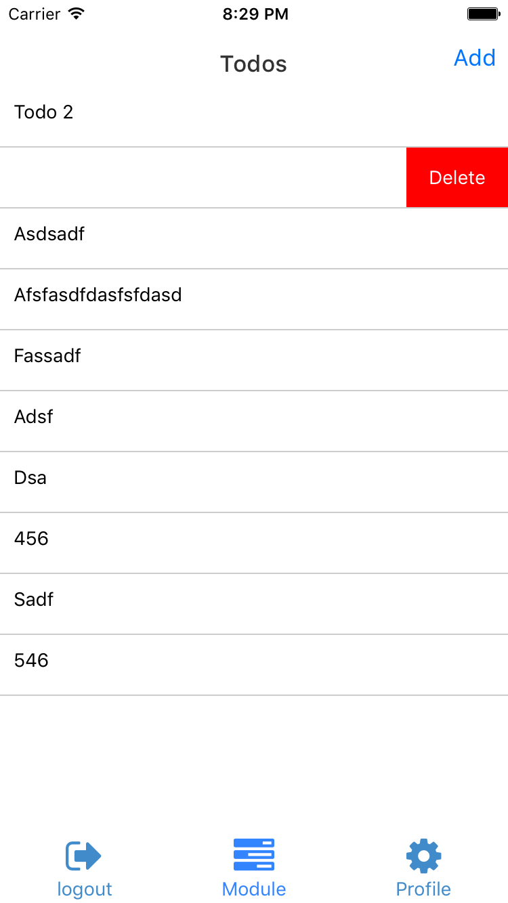

# ReactEngine-Generator

ReactEngine 代码生成器(基于 yoman)  

# 安装
```bash
npm install -g yo   
npm install -g generator-reactengine
```

# 使用说明
## 1. 生成 model
```bash
cd yo-project-dir # 进入你的工程目录     
yo reactengine:model [options] <modelName>
```
#### 选项(options)

| 选项(options) | 描述 | 默认值 |
| ------------------ | --------------- | -------------- |
| `-h`, `--help`     | 显示此帮助信息    |                |
| `--skip-cache`     | 不要记住我的选择  | 默认: false     |
| `--skip-install`   | 不要自动安装依赖  | 默认: false     |

#### 参数

| 参数   | 描述 | 类型 | 是否必须 |
| ----------- | -------------- | ------- | -------- |
| modelName  |    模块名称     | 字符串   |     是    |

#### 实例

如下命令   
```bash
yo reactengine:model book
```
会在 ```你的工程目录/src/services/strongloop/models``` 下生成一个 ```Book.js``` 文件,     ```Book``` Model 封装了 ```create/find/findById/findOne/count/exists/update/updateOrCreate/updateAttributes/deleteById``` 等方法,用于和服务器交互.你也可以在  ```Book.js``` 扩展该 Model.   
具体请参考 [ReactEngine](https://github.com/ReactEngine/ReactEngine).


## 2. 生成 module
```
cd yo-project-dir # 进入你的工程目录
yo reactengine:module [options] <moduleName>
```
#### 选项(options)

| 选项(options) | 描述 | 默认值 |
| ------------------ | --------------- | -------------- |
| `-h`, `--help`     | 显示此帮助信息    |                |
| `--skip-cache`     | 不要记住我的选择  | 默认: false     |
| `--skip-install`   | 不要自动安装依赖  | 默认: false     |

#### 参数

| 参数   	  | 	描述 		| 	类型   | 	是否必须 |
| ----------- | -------------- | ------- | ---------- |
| moduleName  |    模块名称     | 字符串   |     是      |

#### 实例

如下命令   
```bash
yo reactengine:module todo
```
会在 ```你的工程目录/src/modules``` 下创建一个 ```todo``` 文件夹,    包含了redux 需要的 ```actions/constants/components/containers/reducers ``` 等组件,一个简单的列表和可以跑通的增删改查的流程.  
具体请参考 [ReactEngine](https://github.com/ReactEngine/ReactEngine).
相关截图:  
<p>
  
  
  
  
  
</p>